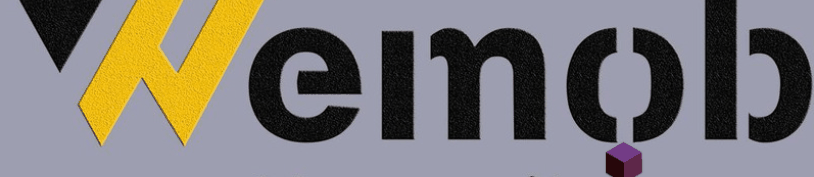
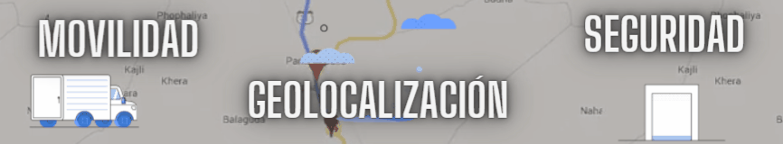
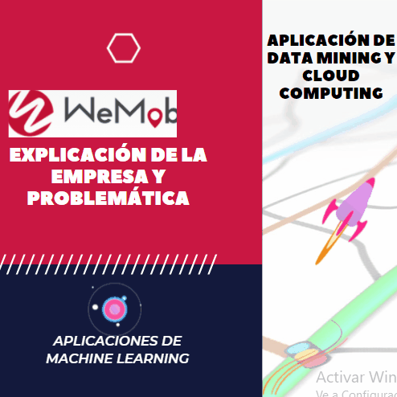
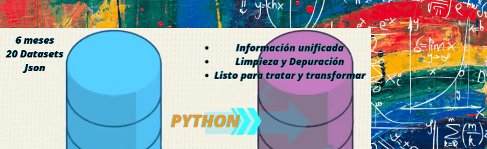

---
output:
  rmdformats::material:
    css : Tfm3.css
    highlight: kate
    self_contained: true
    code_folding: hide
    thumbnails: true
    gallery: true
    fig_width: 4
    fig_height: 4
    df_print: kable
---

```{r setup, include=FALSE}
knitr::opts_chunk$set(echo = TRUE, warning = FALSE, message = FALSE)
```

<div class="social">
<ul>
<li><a href="https://www.facebook.com/public/Daniela-Arango" target="_blank"></a></li>
<li><a href="https://danielaarango94.shinyapps.io/WeddingRiskModel_App/" target="_blank"></a></li>
<li><a href="https://www.linkedin.com/in/daniela-maria-arango-giraldo-680584173/?originalSubdomain=es" target="_blank"></a></li>
<li><a href="https://github.com/darango94" target="_blank"></a></li>
</ul>
</div>


<center></center>


# 


<p style="text-align: justify;"> __Empresa a nivel mundial con más de 10 años de experiencia en el sector de  nuevas tecnologías__</p>


<center></center>


<p style="text-align: justify;"> __Hemos realizado un análisis sobre un conjunto de datos reales de transporte de mercancías por carretera a nivel nacional, a través de técnicas y tecnologías de Big Data conforme a las necesidades y objetivos de la Empresa colaboradora. __</p>


<iframe src="http://wemob.es/nosotros.html" style="border:none;" scrolling ="no" width="100%" height="720px"></iframe>


# 

## __Dinámica del Proyecto__ {.tabset}

```{r, echo=FALSE}
icon::fa("charging-station", size = 3, colour = "#f3ef0a", animate = "spin")
```

<div class="progress">
  <div class="progress-bar bg-success" role="progressbar" style="width: 25%" aria-valuenow="25" aria-valuemin="0" aria-valuemax="100" color="black"></div>
</div>

<center></center>


<style>
div.blue pre { background-color:transparent; }
div.blue pre.r { background-color:#2e946e; }
div.blue pre.r {opacity:0.9;}
div.blue pre.r {color:black;}
div.blue pre.r {font-size: 0.9em;}
div.blue pre.r {font-family: Broadway;}
</style>


#  


## __Rutas__ {.tabset}

```{r, echo=FALSE}
icon::fa("search-location", size = 3, colour = "#f3ef0a", animate = "spin")
```

<div class="progress">
  <div class="progress-bar bg-success" role="progressbar" style="width: 25%" aria-valuenow="25" aria-valuemin="0" aria-valuemax="100"></div>
</div>


<center></center>


#  

## __Carga y Depuración del Dataset__ {.tabset}

```{r, echo=FALSE}
icon::fa("battery-quarter", size = 3, colour = "#f3ef0a", animate = "spin")
```

<div class="progress">
  <div class="progress-bar bg-success" role="progressbar" style="width: 25%" aria-valuenow="25" aria-valuemin="0" aria-valuemax="100"></div>
</div>


<p style="text-align: justify;"> __Wemob nos proporcionó más de 10 millones de registros en formato json de los últimos 6 meses lo equivalente a 3 terabytes.__ 
</p>


<center></center>


