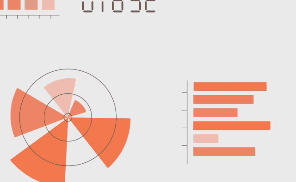
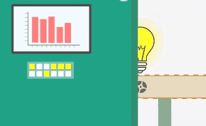

## 

<a href="https://dub01.online.tableau.com/t/darango94/views/GraficosNormalizado/Global?:showVizHome=no&:embed=true" 
target="principal">
</a>

<a href="https://dub01.online.tableau.com/t/darango94/views/GraficosNormalizado/Rutas_Conductores?:showVizHome=no&:embed=true" target="principal">
</a>

<a href="https://dub01.online.tableau.com/t/darango94/views/GraficosNormalizado/Rutas_Matriculas?:showVizHome=no&:embed=true" target="principal">
</a>

<a href="https://www.google.com/maps/d/embed?mid=1Ct-LnfCG1IoxOFgcoJVMsusRhF_eaJkQ"target="principal">
</a>

<a href="https://dub01.online.tableau.com/t/darango94/views/Mapa_Rutas_todas/MapaRutasWemob?:showVizHome=no&:embed=true" target = "principal">
</a>

<iframe src="https://dub01.online.tableau.com/t/darango94/views/GraficosNormalizado/Global?:showVizHome=no&:embed=true"
name="principal" style="border:none;" width="1346.5" height="551" aling="center"></iframe> 

